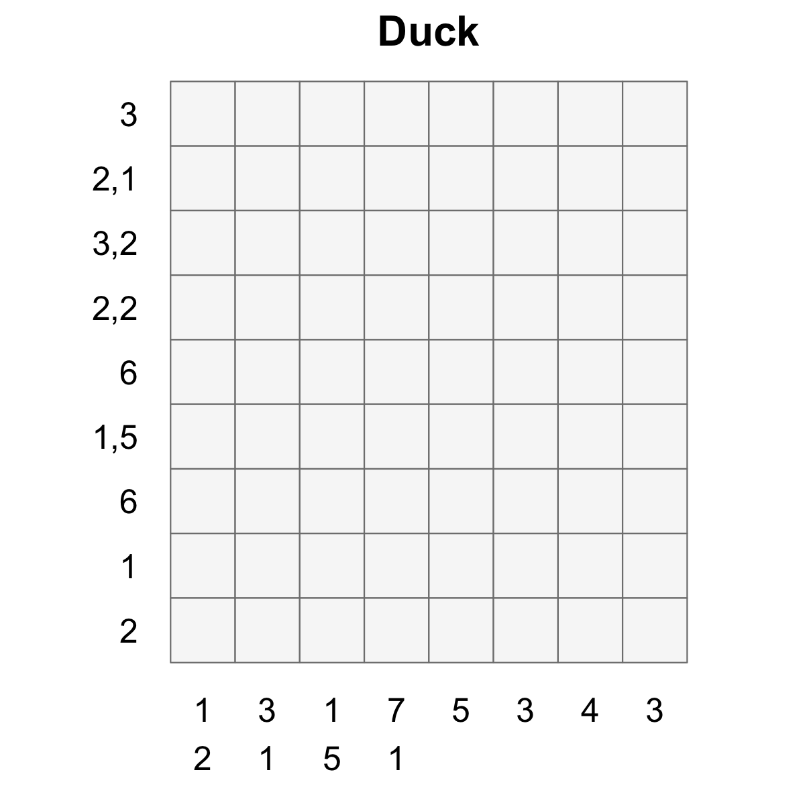
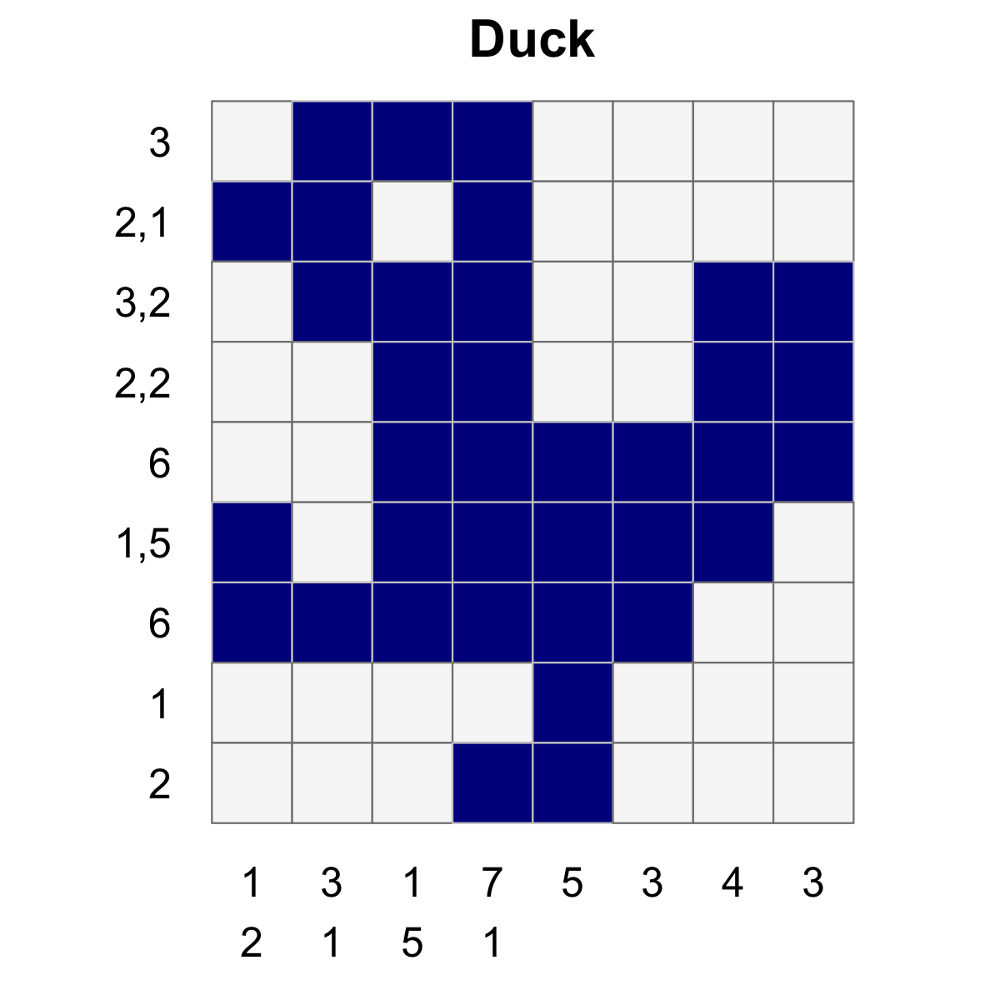

---
output:
  md_document:
    variant: gfm
---

<!-- README.md is generated from README.Rmd. Please edit that file -->

```{r, echo = FALSE}

suppressPackageStartupMessages({
  library(dplyr)
  library(ggplot2)
  
  library(nonogram)
})


knitr::opts_chunk$set(
  collapse = TRUE,
  comment = "#>",
  fig.path = "figures/"
)
```


Nonograms
------------------------------------------------------------------------------

Nonograms are picture logic puzzles in which cells in a grid must be colored or left blank according to numbers at the side of the grid to reveal a hidden picture.

<div style="float: left;">
  
</div>


The `nonogram` package contains a solver and methods for plotting and manipulating
nonogram puzzles.


Installation
------------------------------------------------------------------------------

You can install `nonogram` from github with:

```{r gh-installation, eval = FALSE}
# install.packages("devtools")
devtools::install_github("coolbutuseless/nonogram")
```


Example
------------------------------------------------------------------------------

This is a basic example which shows you how to plot and solve a simple puzzle.

### Use one of the puzzle strings in the package

```{r example}
puzzle_string <- puzzle_string_examples[['duck']] 
puzzle        <- convert_puzzle_string_to_puzzle(puzzle_string)
```

### Puzzle and Puzzle String representation

```{r echo=FALSE, comment=NA}
cat('> puzzle_string')
strwrap(puzzle_string, width = 60) %>% cat


cat("\n> puzzle")
deparse(puzzle) %>% paste(collapse="\n") %>% cat()
```

### Plot the unsolved puzzle

```{r duck-unsolved}
create_puzzle_plot(puzzle, title="Duck")
```

### Solve the puzzle

```{r}
solution_matrix <- solve_puzzle(puzzle) 
solution_matrix
```


### Plot the solved puzzle

```{r duck-solution}
create_puzzle_plot(puzzle, solution_matrix, title="Duck")
```


### An all-in-one example

```{r all-in-one}
puzzle <- puzzle_string_examples[['R']]
puzzle

puzzle %>%
  solve_puzzle(verbose=TRUE) %>%
  create_puzzle_plot(puzzle, ., show_clues=TRUE)
```


### Create your own puzzles

To make, print and solve your own nonograms, you just need to create a *puzzle string*.

The `puzzle string` format used to define puzzles is quite simple:

* the numbers for each clue are separated by a comma
* each clue is separated by a colon
* the clues for the rows come first, then a dash, then the clues for the columns
* row clues are read from left to right
* column clues are read from top to bottom


```{r create-your-own}
puzzle_string <- "3:1:1,1-3:1:1,1"
solution      <- solve_puzzle(puzzle_string)
create_puzzle_plot(puzzle_string, solution)
```


