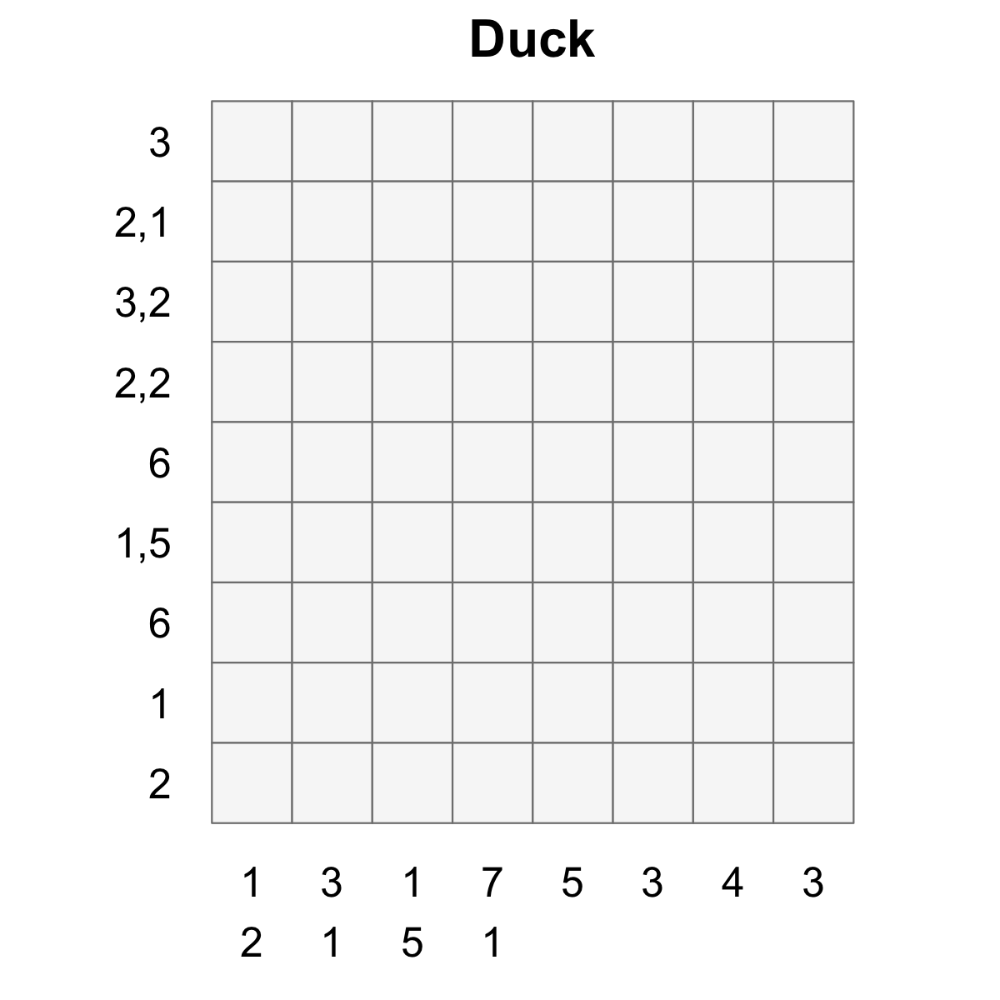
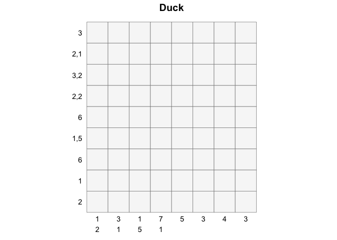
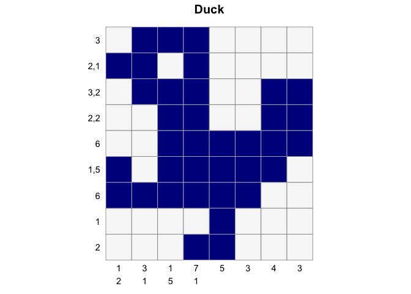
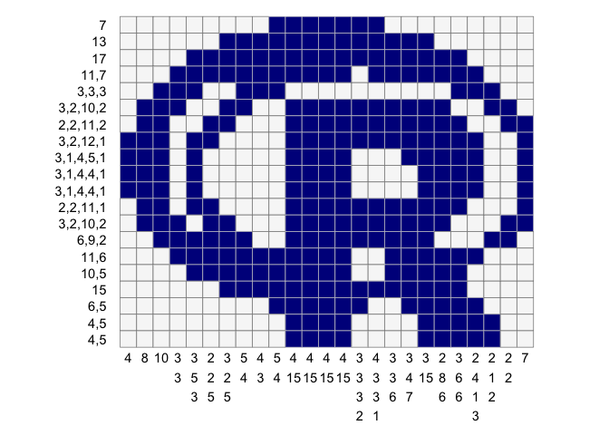
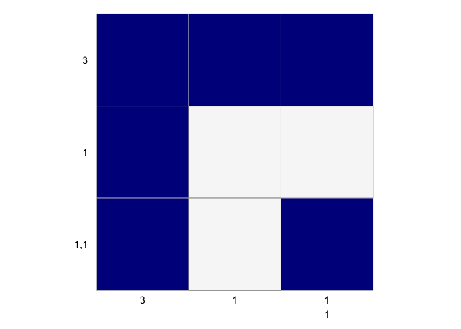

<!-- README.md is generated from README.Rmd. Please edit that file -->

## Nonograms

Nonograms are picture logic puzzles in which cells in a grid must be
colored or left blank according to numbers at the side of the grid to
reveal a hidden
picture.

<div style="float: left;">



</div>

The `nonogram` package contains a solver and methods for plotting and
manipulating nonogram puzzles.

## Installation

You can install `nonogram` from github with:

``` r
# install.packages("devtools")
devtools::install_github("coolbutuseless/nonogram")
```

## Example

This is a basic example which shows you how to plot and solve a simple
puzzle.

### Use one of the puzzle strings in the package

``` r
puzzle_string <- puzzle_string_examples[['duck']] 
puzzle        <- convert_puzzle_string_to_puzzle(puzzle_string)
```

### Puzzle and Puzzle String representation

    > puzzle_string
    3:2,1:3,2:2,2:6:1,5:6:1:2-1,2:3,1:1,5:7,1:5:3:4:3
    
    > puzzle
    list(row_clues = list(3L, 2:1, 3:2, c(2L, 2L), 6L, c(1L, 5L), 
        6L, 1L, 2L), col_clues = list(1:2, c(3L, 1L), c(1L, 5L), 
        c(7L, 1L), 5L, 3L, 4L, 3L))

### Plot the unsolved puzzle

``` r
create_puzzle_plot(puzzle, title="Duck")
```

<!-- -->

### Solve the puzzle

``` r
solution_matrix <- solve_puzzle(puzzle) 
solution_matrix
#>       [,1] [,2] [,3] [,4] [,5] [,6] [,7] [,8]
#>  [1,]    0    1    1    1    0    0    0    0
#>  [2,]    1    1    0    1    0    0    0    0
#>  [3,]    0    1    1    1    0    0    1    1
#>  [4,]    0    0    1    1    0    0    1    1
#>  [5,]    0    0    1    1    1    1    1    1
#>  [6,]    1    0    1    1    1    1    1    0
#>  [7,]    1    1    1    1    1    1    0    0
#>  [8,]    0    0    0    0    1    0    0    0
#>  [9,]    0    0    0    1    1    0    0    0
```

### Plot the solved puzzle

``` r
create_puzzle_plot(puzzle, solution_matrix, title="Duck")
```

<!-- -->

### An all-in-one example

``` r
puzzle <- puzzle_string_examples[['R']]
puzzle
#> [1] "7:13:17:11,7:3,3,3:3,2,10,2:2,2,11,2:3,2,12,1:3,1,4,5,1:3,1,4,4,1:3,1,4,4,1:2,2,11,1:3,2,10,2:6,9,2:11,6:10,5:15:6,5:4,5:4,5-4:8:10:3,3:3,5,3:2,2,5:3,2,5:5,4:4,3:5,4:4,15:4,15:4,15:4,15:3,3,3,2:4,3,3,1:3,3,6:3,4,7:3,15:2,8,6:3,6,6:2,4,1,3:2,1,2:2,2:7"

puzzle %>%
  solve_puzzle(verbose=TRUE) %>%
  create_puzzle_plot(puzzle, ., show_clues=TRUE)
#> ------------------------------------------------------------
#> Creating all possible pattern sets. This can take up to a minute (and lots of ram) for some puzzles ...
#> Creation of all possible pattern sets from the given clues: 0.02 seconds
#> Starting (Row) x (Column) combinations: 5.8e+39 x 1.21e+37
#> Filtered (Row) x (Column) combinations:    1 x    1
#> Total solution time: 0.01 seconds
#> ------------------------------------------------------------
```

<!-- -->

### Create your own puzzles

To make, print and solve your own nonograms, you just need to create a
*puzzle string*.

The `puzzle string` format used to define puzzles is quite simple:

  - the numbers for each clue are separated by a comma
  - each clue is separated by a colon
  - the clues for the rows come first, then a dash, then the clues for
    the columns
  - row clues are read from left to right
  - column clues are read from top to bottom

<!-- end list -->

``` r
puzzle_string <- "3:1:1,1-3:1:1,1"
solution      <- solve_puzzle(puzzle_string)
create_puzzle_plot(puzzle_string, solution)
```

<!-- -->
